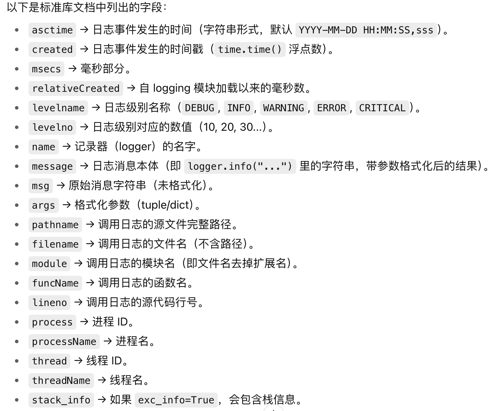

# Python Logging 模块完全指南

## 背景介绍

在程序开发过程中，我们经常需要记录程序的运行状态，用于调试错误、监控运行情况或分析程序行为。虽然可以使用 `print()` 来输出信息，但这种方式存在诸多局限性：

- 无法控制输出级别
- 难以将信息保存到文件
- 无法格式化输出内容
- 生产环境需要手动删除调试信息

Python 的 `logging` 模块就像是一个**专业的日志管家**，它能够帮你：

- 智能分级记录信息（从调试信息到严重错误）
- 同时输出到多个地方（终端、文件、网络等）
- 美化格式化日志内容
- 灵活控制日志的过滤和处理

## 核心概念

### 1. Logger (记录器)

**比喻**：Logger 就像是一个**新闻记者**，负责收集和记录各种"新闻"（日志信息）。

- 每个 Logger 都有一个名字（通常使用模块名）
- Logger 是日志系统的入口点
- 可以设置日志级别，决定记录哪些级别的信息
- `getLogger()` 不传入参数默认创建一个 `root logger`
  - 如果不显式创建它，它只处理 `WARNING` 及以上级别的日志，并且因为没有处理器，任何日志事件都无法被输出。
  - `logging.basicConfig()` 的作用就是通过为其添加一个 `StreamHandler` 来“激活”它，使其能够将日志输出到控制台。

### 2. Handler (处理器)

**比喻**：Handler 就像是**不同的发布渠道**，决定日志信息发布到哪里。

- `StreamHandler`：发布到终端（控制台）
- `FileHandler`：发布到文件
- `RotatingFileHandler`：发布到滚动文件（避免文件过大）
- `HTTPHandler`：发布到网络服务

### 3. Formatter (格式化器)

**比喻**：Formatter 就像是**编辑器**，决定日志信息以什么格式呈现。

- 控制日志的显示格式
- 可以包含时间戳、日志级别、模块名、消息内容等
- 不同的 Handler 可以使用不同的 Formatter



### 4. Filter (过滤器)

**比喻**：Filter 就像是**审查员**，决定哪些日志信息可以通过。

- 提供比日志级别更细粒度的控制
- 可以基于各种条件过滤日志

## 日志级别详解

Python logging 提供了5个标准的日志级别，从低到高分别是：

| 级别     | 数值 | 使用场景       | 生活比喻                |
| -------- | ---- | -------------- | ----------------------- |
| DEBUG    | 10   | 详细的调试信息 | 📝 写日记的细节记录     |
| INFO     | 20   | 一般信息       | 📢 日常生活的重要通知   |
| WARNING  | 30   | 警告信息       | ⚠️ 天气预报的大风警告 |
| ERROR    | 40   | 错误信息       | ❌ 汽车故障报警         |
| CRITICAL | 50   | 严重错误       | 🚨 火灾警报             |

**重要概念**：Logger 只会处理大于等于其设定级别的日志。例如，如果 Logger 设置为 INFO 级别，那么 DEBUG 级别的日志就不会被处理。

## 分层结构

```
Logger (记录器)
    ├── Handler 1 (处理器1 - 控制台输出)
    │   ├── Formatter (格式化器)
    │   └── Filter (过滤器)
    ├── Handler 2 (处理器2 - 文件输出)
    │   ├── Formatter (格式化器)
    │   └── Filter (过滤器)
    └── Handler 3 (处理器3 - 网络输出)
        ├── Formatter (格式化器)
        └── Filter (过滤器)
```

## 日志运行流程

1. **创建日志记录**：程序调用 `logger.info("消息")` 等方法
2. **级别检查**：Logger 检查该日志级别是否应该被处理
3. **创建 LogRecord**：创建包含所有日志信息的记录对象
4. **分发给 Handlers**：将 LogRecord 发送给所有配置的 Handler
5. **Handler 处理**：每个 Handler 独立处理日志记录
   - 再次检查日志级别
   - 应用过滤器
   - 使用格式化器格式化内容
   - 输出到目标位置
6. 子 logger 将这条信息反向传播到父 logger 当中，由父 logger 再次处理 (可由 propagation 控制)

## 代码示例解析

### 基础用法

```python
import logging

# 配置日志
logging.basicConfig(level=logging.INFO)

# 获取 logger
logger = logging.getLogger(__name__)

# 记录日志
logger.info("这是一条信息")
```

### 高级用法 - 多输出目标

```python
import logging

# 创建 logger
logger = logging.getLogger('MyApp')
logger.setLevel(logging.DEBUG)

# 创建 handlers
console_handler = logging.StreamHandler()
file_handler = logging.FileHandler('app.log')

# 设置级别
console_handler.setLevel(logging.INFO)
file_handler.setLevel(logging.DEBUG)

# 创建 formatters
console_format = logging.Formatter('%(name)s - %(levelname)s - %(message)s')
file_format = logging.Formatter('%(asctime)s - %(name)s - %(levelname)s - %(message)s')

# 设置 formatters
console_handler.setFormatter(console_format)
file_handler.setFormatter(file_format)

# 添加 handlers 到 logger
logger.addHandler(console_handler)
logger.addHandler(file_handler)

# 测试日志
logger.debug('这是调试信息')
logger.info('这是普通信息')
logger.warning('这是警告信息')
logger.error('这是错误信息')
logger.critical('这是严重错误信息')
```

## 最佳实践

### 1. 命名规范

```python
# 推荐：使用模块名
logger = logging.getLogger(__name__)

# 不推荐：使用硬编码名称
logger = logging.getLogger('mylogger')
```

### 2. 日志级别选择

- **开发阶段**：使用 DEBUG 级别查看详细信息
- **生产环境**：使用 INFO 或 WARNING 级别减少日志量
- **关键错误**：使用 ERROR 或 CRITICAL 级别

### 3. 性能考虑

```python
# 好的做法：使用字符串格式化
logger.info("用户 %s 登录成功", username)

# 避免：字符串拼接
logger.info("用户 " + username + " 登录成功")

# 对于复杂格式化，使用条件检查
if logger.isEnabledFor(logging.DEBUG):
    logger.debug("复杂的调试信息: %s", expensive_operation())
```

## 常见问题解决

### Q1: 为什么我的日志没有输出？

**A**: 检查日志级别设置。Logger 和 Handler 都有级别限制。

### Q2: 如何避免重复日志？

**A**: 检查是否多次添加了相同的 Handler，或者父子 Logger 的传播机制。

### Q3: 如何在多模块中使用日志？

**A**: 每个模块使用 `logging.getLogger(__name__)` 创建自己的 Logger。

## 总结

Python 的 logging 模块提供了一个强大且灵活的日志记录系统：

- **Logger** 是入口点，负责收集日志
- **Handler** 决定日志的输出目标
- **Formatter** 控制日志的显示格式
- **Filter** 提供精细的过滤控制

通过合理配置这些组件，可以构建一个满足各种需求的日志系统，既能帮助开发调试，又能监控生产环境的运行状态。

记住：好的日志系统就像是程序的"黑匣子"，能够在关键时刻提供宝贵的信息！
